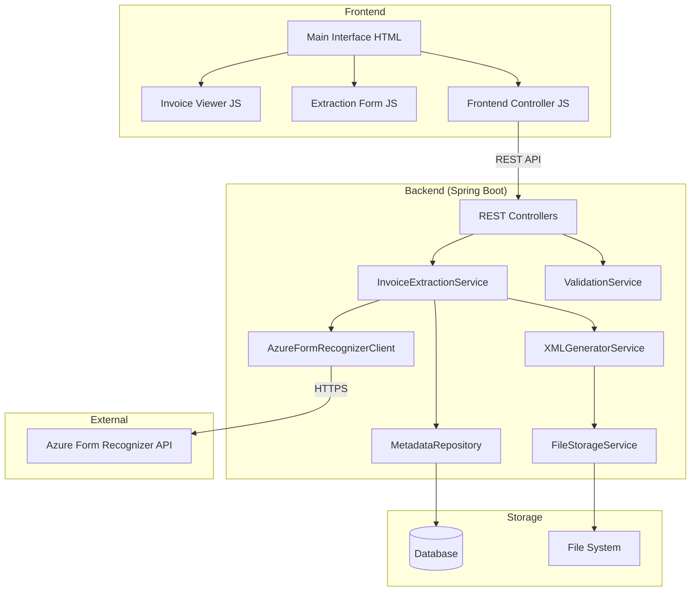

# Design Document: AI Invoice Extraction System

## Overview

El sistema de extracción automática de datos de facturas con IA es una aplicación web que permite a los usuarios cargar facturas en formato PDF o imagen, procesarlas mediante inteligencia artificial para extraer información estructurada, validar y editar los datos extraídos, y exportarlos a formato XML.

### Objetivos del Diseño

1. **Precisión en la extracción**: Utilizar modelos de IA avanzados para lograr alta precisión en la extracción de datos de facturas con layouts variables
2. **Experiencia de usuario fluida**: Proporcionar una interfaz intuitiva con visualización lado a lado del documento y formulario editable
3. **Modularidad**: Diseñar componentes independientes y reutilizables que faciliten el mantenimiento y extensión futura
4. **Procesamiento eficiente**: Completar la extracción en menos de 30 segundos para documentos de hasta 10MB
5. **Validación robusta**: Implementar validación de datos en múltiples niveles para garantizar calidad de la información extraída

### Alcance

**Incluido en este diseño:**
- Interfaz de usuario dual-panel (visualizador + formulario)
- Módulo de procesamiento con IA para extracción de datos
- Sistema de validación de datos extraídos
- Generación de archivos XML estructurados
- Manejo de errores y recuperación
- Persistencia de datos y asociación documento-XML

**Fuera del alcance:**
- Integración con sistemas ERP externos
- Procesamiento batch de múltiples facturas simultáneas
- Reconocimiento de firmas o sellos
- Extracción de tablas de líneas de detalle (line items)

## Architecture

### Architectural Style

El sistema sigue una **arquitectura cliente-servidor con backend Java** y separación clara de responsabilidades:

```
┌─────────────────────────────────────────────────────────────┐
│                   FRONTEND (Client-Side)                     │
│                                                               │
│  ┌──────────────────┐         ┌─────────────────────────┐  │
│  │  Invoice Viewer  │         │   Extraction Form       │  │
│  │   (PDF.js)       │         │   (HTML + Validation)   │  │
│  └──────────────────┘         └─────────────────────────┘  │
│                                                               │
│  ┌──────────────────────────────────────────────────────┐  │
│  │           Frontend Controller (JavaScript)            │  │
│  │  (Manages UI state, calls REST API)                  │  │
│  └──────────────────────────────────────────────────────┘  │
└─────────────────────────────────────────────────────────────┘
                              │
                         REST API (HTTP)
                              │
                              ▼
┌─────────────────────────────────────────────────────────────┐
│                BACKEND (Java + Spring Boot)                  │
│                                                               │
│  ┌──────────────────────────────────────────────────────┐  │
│  │              REST Controllers Layer                   │  │
│  │  (InvoiceController, FileController)                 │  │
│  └──────────────────────────────────────────────────────┘  │
│                              │                               │
│                              ▼                               │
│  ┌──────────────────────────────────────────────────────┐  │
│  │                 Service Layer                         │  │
│  │  (InvoiceExtractionService, ValidationService)       │  │
│  └──────────────────────────────────────────────────────┘  │
│                              │                               │
│                              ▼                               │
│  ┌──────────────────────────────────────────────────────┐  │
│  │              Processing Components                    │  │
│  │  ┌────────────────┐  ┌──────────┐  ┌─────────────┐  │  │
│  │  │ Azure Form     │  │Validator │  │XML Generator│  │  │
│  │  │ Recognizer     │  │ (Rules)  │  │  (JAXB)     │  │  │
│  │  │ Client         │  │          │  │             │  │  │
│  │  └────────────────┘  └──────────┘  └─────────────┘  │  │
│  └──────────────────────────────────────────────────────┘  │
│                              │                               │
│                              ▼                               │
│  ┌──────────────────────────────────────────────────────┐  │
│  │              Storage Layer                            │  │
│  │  ┌──────────────┐         ┌─────────────────────┐   │  │
│  │  │ File System  │         │   Database/JPA      │   │  │
│  │  │ (XML files)  │         │   (Metadata)        │   │  │
│  │  └──────────────┘         └─────────────────────┘   │  │
│  └──────────────────────────────────────────────────────┘  │
└─────────────────────────────────────────────────────────────┘
                              │
                              ▼
                    ┌─────────────────────┐
                    │  Azure Form         │
                    │  Recognizer API     │
                    │  (Cloud Service)    │
                    └─────────────────────┘
```

### Technology Stack

**Frontend:**
- HTML5 + CSS3 para la interfaz de usuario
- JavaScript (ES6+) para lógica de aplicación y llamadas REST API
- PDF.js para renderizado de documentos PDF
- Canvas API para visualización de imágenes
- Fetch API para comunicación con backend REST

**Backend:**
- **Java 17+** (LTS version)
- **Spring Boot 3.x** como framework principal
  - **Spring Web** para REST API
  - **Spring Data JPA** para persistencia de metadatos
  - **Spring Validation** para validación de datos
- **H2/PostgreSQL** para base de datos (H2 para desarrollo, PostgreSQL para producción)
- **Maven** para gestión de dependencias y build

**AI Processing:**
- **Azure Form Recognizer (Azure AI Document Intelligence)** - Servicio especializado en extracción de datos de facturas
  - **Modelo**: `prebuilt-invoice` (pre-entrenado específicamente para facturas)
  - **Ventajas**: 
    - Modelo pre-entrenado específico para facturas
    - 500 páginas gratis/mes permanentemente
    - Alta precisión para documentos financieros (>95% en campos estándar)
    - SDK oficial de Azure para Java con soporte completo
    - Maneja múltiples layouts sin configuración adicional
    - Soporta múltiples idiomas (español, inglés, etc.)
  - **Costo**: $0.001 por página después del tier gratuito
  - **Endpoint**: `https://<resource-name>.cognitiveservices.azure.com/`
  - **API Version**: 2023-07-31 o superior

**Librerías Java:**
- **Azure AI Form Recognizer SDK** (`com.azure:azure-ai-formrecognizer:4.1.0+`) para integración con Azure
- **JAXB** (Jakarta XML Binding) para generación y validación de XML
- **Lombok** para reducir boilerplate code
- **SLF4J + Logback** para logging
- **Jackson** para serialización JSON (incluido en Spring Boot)
- **Apache Commons IO** para operaciones de archivos

**Storage:**
- **File System** para almacenamiento de archivos XML (configurable vía `application.properties`)
- **Base de datos relacional** (H2/PostgreSQL) para metadatos y asociaciones documento-XML
- **Multipart File Upload** para recepción de documentos desde frontend

### Design Decisions

#### 1. Elección de Tecnología de IA

**Decisión**: Utilizar Azure Form Recognizer (Azure AI Document Intelligence) con el modelo `prebuilt-invoice` como motor principal de extracción.

**Justificación**:
- Los requisitos especifican manejo de "facturas con diferentes diseños y formatos" (Req. 7.1)
- Azure Form Recognizer tiene un **modelo pre-entrenado específico para facturas** (`prebuilt-invoice`) que extrae campos estructurados automáticamente sin necesidad de entrenamiento
- **Tier gratuito generoso**: 500 páginas/mes permanentemente (suficiente para ~500 facturas mensuales)
- **Alta precisión**: Diseñado específicamente para documentos financieros, alcanza >95% de precisión en campos estándar
- **SDK nativo para Java**: Integración oficial con Spring Boot mediante `com.azure:azure-ai-formrecognizer`
- **Costo muy bajo**: Solo $0.001 por página después del tier gratuito (100x más económico que LLMs)
- **Rendimiento**: Procesamiento típico de 3-8 segundos por factura, cumple con el requisito de 30 segundos (Req. 3.11)
- **Multiidioma**: Maneja español, inglés y otros idiomas sin configuración adicional (Req. 7.2)
- **Campos extraídos automáticamente**: Vendor name, address, invoice number, dates, amounts, line items, etc.
- **Confiabilidad**: Servicio empresarial con SLA del 99.9%

**Alternativas consideradas**:
- **GPT-4 Vision/Claude 3.5**: Mayor costo por uso (~$0.01-0.03 por factura), no especializado en facturas, requiere prompt engineering
- **Azure Computer Vision OCR**: Menos preciso para facturas, no tiene modelo pre-entrenado para documentos financieros, requiere post-procesamiento manual
- **Tesseract OCR**: Requeriría templates complejos, menor precisión con layouts variables, no maneja campos estructurados
- **Servicios especializados** (Nanonets, Docsumo): Vendor lock-in, costos recurrentes más altos, menor control sobre infraestructura

#### 2. Arquitectura Cliente-Servidor con Java Backend

**Decisión**: Arquitectura cliente-servidor con backend Java + Spring Boot y frontend JavaScript.

**Justificación**:
- **Seguridad**: Azure API keys deben mantenerse en servidor, nunca expuestas en cliente
- **Escalabilidad**: Spring Boot permite escalar horizontalmente para múltiples usuarios concurrentes
- **Integración empresarial**: Java es estándar en entornos corporativos, facilita integración con sistemas legacy
- **Procesamiento robusto**: Backend maneja procesamiento pesado (llamadas a Azure, generación XML, validación)
- **Mejor UX**: Frontend ligero solo maneja renderizado y validación básica
- **Mantenibilidad**: Separación clara de responsabilidades entre capas

**Comunicación**:
- REST API con JSON para intercambio de datos
- Multipart/form-data para upload de archivos
- Endpoints RESTful siguiendo convenciones Spring Boot

#### 3. Formato de Almacenamiento

**Decisión**: XML como formato de salida con esquema definido + Base de datos para metadatos.

**Justificación**:
- Requisito explícito (Req. 6)
- XML permite validación contra esquema (XSD) usando JAXB
- Ampliamente soportado para integración con sistemas legacy
- Base de datos relacional (PostgreSQL) para metadatos permite:
  - Búsquedas eficientes de facturas procesadas
  - Asociaciones robustas documento-XML
  - Auditoría y trazabilidad
  - Escalabilidad para múltiples usuarios

## Components and Interfaces

### Component Diagram



### 1. Main Interface Component

**Responsabilidad**: Punto de entrada y orquestación de la UI principal.

**Interfaces**:
```javascript
class MainInterface {
  /**
   * Inicializa la interfaz principal
   */
  initialize(): void;
  
  /**
   * Abre la vista de extracción con IA
   */
  openExtractionView(): void;
  
  /**
   * Cierra la vista de extracción
   */
  closeExtractionView(): void;
}
```

**Dependencias**: InvoiceViewer, ExtractionForm, ExtractionController

### 2. Invoice Viewer Component

**Responsabilidad**: Visualización de documentos PDF e imágenes en el panel izquierdo.

**Interfaces**:
```javascript
class InvoiceViewer {
  /**
   * Carga y renderiza un documento
   * @param file - Archivo PDF o imagen
   * @returns Promise que resuelve cuando el documento está renderizado
   */
  loadDocument(file: File): Promise<void>;
  
  /**
   * Obtiene la representación del documento para procesamiento
   * @returns Datos del documento en formato base64 o Blob
   */
  getDocumentData(): Promise<string | Blob>;
  
  /**
   * Limpia el visor
   */
  clear(): void;
  
  /**
   * Maneja errores de carga
   * @param error - Error ocurrido
   */
  handleLoadError(error: Error): void;
}
```

**Dependencias**: PDF.js (para PDFs), Canvas API (para imágenes)

**Validaciones**:
- Verificar formato de archivo soportado (PDF, JPEG, PNG, TIFF)
- Validar tamaño máximo de archivo (10MB)
- Verificar que el archivo no esté corrupto

### 3. Extraction Form Component

**Responsabilidad**: Formulario editable que muestra y permite modificar datos extraídos.

**Interfaces**:
```javascript
class ExtractionForm {
  /**
   * Inicializa el formulario con campos vacíos
   */
  initialize(): void;
  
  /**
   * Puebla el formulario con datos extraídos
   * @param data - Datos extraídos por la IA
   */
  populateFields(data: InvoiceData): void;
  
  /**
   * Obtiene los datos actuales del formulario
   * @returns Datos del formulario
   */
  getFormData(): InvoiceData;
  
  /**
   * Valida los datos del formulario
   * @returns Resultado de validación con errores si existen
   */
  validate(): ValidationResult;
  
  /**
   * Muestra indicadores visuales de validación
   * @param validationResult - Resultado de validación
   */
  showValidationFeedback(validationResult: ValidationResult): void;
  
  /**
   * Limpia el formulario
   */
  clear(): void;
  
  /**
   * Registra callback para cambios en campos
   * @param callback - Función a ejecutar cuando cambia un campo
   */
  onFieldChange(callback: (field: string, value: string) => void): void;
}
```

**Dependencias**: Validator

### 4. Extraction Controller Component

**Responsabilidad**: Orquesta el flujo de trabajo de extracción y coordina componentes (implementado en backend Java).

**Interfaces**:
```java
@RestController
@RequestMapping("/api/invoices")
public class InvoiceController {
  
  /**
   * Procesa un documento de factura
   * @param file - Archivo a procesar (multipart)
   * @return ResponseEntity con datos extraídos
   */
  @PostMapping("/process")
  public ResponseEntity<InvoiceDataDTO> processInvoice(
    @RequestParam("file") MultipartFile file
  );
  
  /**
   * Guarda los datos extraídos y genera XML
   * @param data - Datos a guardar
   * @return ResponseEntity con ruta del archivo XML generado
   */
  @PostMapping("/save")
  public ResponseEntity<SaveResultDTO> saveExtractedData(
    @RequestBody @Valid InvoiceDataDTO data
  );
  
  /**
   * Carga datos desde un archivo XML existente
   * @param xmlPath - Ruta del archivo XML
   * @return ResponseEntity con datos cargados
   */
  @GetMapping("/load")
  public ResponseEntity<InvoiceDataDTO> loadFromXML(
    @RequestParam("xmlPath") String xmlPath
  );
  
  /**
   * Obtiene el estado actual del procesamiento
   * @param jobId - ID del trabajo de procesamiento
   * @return ResponseEntity con estado actual
   */
  @GetMapping("/status/{jobId}")
  public ResponseEntity<ProcessingStateDTO> getProcessingState(
    @PathVariable String jobId
  );
}
```

**Dependencias**: InvoiceExtractionService, ValidationService, XMLGeneratorService, MetadataRepository

### 5. AI Processor Component (Azure Form Recognizer Integration)

**Responsabilidad**: Extracción de datos estructurados mediante Azure Form Recognizer.

**Interfaces**:
```java
@Service
public class AzureFormRecognizerService {
  
  private final DocumentAnalysisClient client;
  
  /**
   * Extrae datos de un documento de factura usando Azure Form Recognizer
   * @param documentData - Datos del documento (InputStream)
   * @param fileName - Nombre del archivo original
   * @return InvoiceData con datos extraídos
   * @throws InvoiceProcessingException si falla la extracción
   */
  public InvoiceData extractData(
    InputStream documentData,
    String fileName
  ) throws InvoiceProcessingException;
  
  /**
   * Verifica disponibilidad del servicio de Azure
   * @return true si está disponible
   */
  public boolean checkAvailability();
  
  /**
   * Obtiene información de confianza de los campos extraídos
   * @param result - Resultado de análisis de Azure
   * @return Map con confianza por campo
   */
  private Map<String, Float> extractConfidenceScores(
    AnalyzeResult result
  );
}
```

**Implementación con Azure SDK**:
```java
@Service
@Slf4j
public class AzureFormRecognizerService {
  
  @Value("${azure.formrecognizer.endpoint}")
  private String endpoint;
  
  @Value("${azure.formrecognizer.key}")
  private String apiKey;
  
  @Value("${azure.formrecognizer.confidence-threshold:0.7}")
  private float confidenceThreshold;
  
  private DocumentAnalysisClient client;
  
  @PostConstruct
  public void initialize() {
    AzureKeyCredential credential = new AzureKeyCredential(apiKey);
    this.client = new DocumentAnalysisClientBuilder()
      .endpoint(endpoint)
      .credential(credential)
      .buildClient();
    
    log.info("Azure Form Recognizer client initialized");
  }
  
  public InvoiceData extractData(InputStream documentData, String fileName) 
      throws InvoiceProcessingException {
    try {
      log.info("Starting invoice analysis for file: {}", fileName);
      
      // Usar el modelo prebuilt-invoice
      SyncPoller<OperationResult, AnalyzeResult> analyzeInvoicePoller =
        client.beginAnalyzeDocument(
          "prebuilt-invoice",
          BinaryData.fromStream(documentData)
        );
      
      // Esperar resultado (con timeout de 30 segundos)
      AnalyzeResult result = analyzeInvoicePoller
        .setPollInterval(Duration.ofSeconds(1))
        .getFinalResult();
      
      log.info("Analysis completed. Processing {} documents", 
        result.getDocuments().size());
      
      // Extraer datos del primer documento
      if (result.getDocuments().isEmpty()) {
        throw new InvoiceProcessingException("No invoice data found in document");
      }
      
      AnalyzedDocument invoice = result.getDocuments().get(0);
      return mapToInvoiceData(invoice);
      
    } catch (Exception e) {
      log.error("Error processing invoice: {}", e.getMessage(), e);
      throw new InvoiceProcessingException("Failed to extract invoice data", e);
    }
  }
  
  private InvoiceData mapToInvoiceData(AnalyzedDocument invoice) {
    Map<String, DocumentField> fields = invoice.getFields();
    
    InvoiceData data = new InvoiceData();
    
    // Extraer campos con verificación de confianza
    data.setInvoiceNumber(
      extractFieldValue(fields, "InvoiceId", String.class)
    );
    
    // Vendor information
    DocumentField vendorField = fields.get("VendorName");
    if (vendorField != null && vendorField.getConfidence() >= confidenceThreshold) {
      data.setLegalBusinessName(vendorField.getContent());
    }
    
    // Vendor address
    DocumentField addressField = fields.get("VendorAddress");
    if (addressField != null && addressField.getConfidence() >= confidenceThreshold) {
      data.setAddress(addressField.getContent());
    }
    
    // Extract city, postal code, country from address components
    if (addressField != null && addressField.getValueAddress() != null) {
      DocumentAddress address = addressField.getValueAddress();
      data.setCity(address.getCity());
      data.setPostalCode(address.getPostalCode());
      data.setCountry(address.getCountryRegion());
    }
    
    // Document type (siempre "factura" para prebuilt-invoice)
    data.setDocumentType("Factura");
    
    log.info("Extracted invoice data: invoiceNumber={}, vendor={}", 
      data.getInvoiceNumber(), data.getLegalBusinessName());
    
    return data;
  }
  
  private <T> T extractFieldValue(
    Map<String, DocumentField> fields, 
    String fieldName, 
    Class<T> type
  ) {
    DocumentField field = fields.get(fieldName);
    if (field == null || field.getConfidence() < confidenceThreshold) {
      return null;
    }
    
    if (type == String.class) {
      return type.cast(field.getContent());
    }
    
    return null;
  }
  
  public boolean checkAvailability() {
    try {
      // Verificar conectividad con un documento de prueba pequeño
      return client != null;
    } catch (Exception e) {
      log.error("Azure Form Recognizer service unavailable", e);
      return false;
    }
  }
}
```

**Campos extraídos por Azure Form Recognizer**:
- `InvoiceId`: Número de factura
- `VendorName`: Nombre del proveedor (razón social)
- `VendorAddress`: Dirección completa
- `VendorAddressRecipient`: Nombre comercial (si difiere)
- `CustomerName`: Cliente
- `InvoiceDate`: Fecha de factura
- `InvoiceTotal`: Total
- `Items`: Líneas de detalle (fuera del alcance actual)

**Dependencias**: Azure Form Recognizer SDK (`com.azure:azure-ai-formrecognizer`)

**Manejo de errores**:
- Timeout después de 30 segundos (configurable)
- Reintentos automáticos (máximo 3) en caso de errores transitorios
- Logging detallado de errores para debugging
- Manejo de campos con baja confianza (<70%)

### 6. Validator Component

**Responsabilidad**: Validación de datos extraídos según reglas de negocio.

**Interfaces**:
```java
@Service
public class ValidationService {
  
  /**
   * Valida datos de factura completos
   * @param data - Datos a validar
   * @return ValidationResult con errores y warnings
   */
  public ValidationResult validateInvoiceData(InvoiceDataDTO data);
  
  /**
   * Valida un campo específico
   * @param fieldName - Nombre del campo
   * @param value - Valor a validar
   * @param context - Contexto adicional (ej: país para validar código postal)
   * @return FieldValidationResult
   */
  public FieldValidationResult validateField(
    String fieldName,
    String value,
    Map<String, Object> context
  );
  
  /**
   * Valida código postal según país
   * @param postalCode - Código postal
   * @param country - País (código ISO)
   * @return true si es válido
   */
  public boolean validatePostalCode(String postalCode, String country);
}
```

**Implementación con Spring Validation**:
```java
@Service
@Slf4j
public class ValidationService {
  
  private static final Map<String, Pattern> POSTAL_CODE_PATTERNS = Map.of(
    "ES", Pattern.compile("^\\d{5}$"),  // España: 5 dígitos
    "US", Pattern.compile("^\\d{5}(-\\d{4})?$"),  // USA: 5 dígitos o 5+4
    "FR", Pattern.compile("^\\d{5}$"),  // Francia: 5 dígitos
    "DE", Pattern.compile("^\\d{5}$"),  // Alemania: 5 dígitos
    "GB", Pattern.compile("^[A-Z]{1,2}\\d{1,2}[A-Z]?\\s?\\d[A-Z]{2}$")  // UK
  );
  
  private static final Set<String> REQUIRED_FIELDS = Set.of(
    "documentType",
    "invoiceNumber",
    "legalBusinessName",
    "country"
  );
  
  private static final Map<String, Integer> MAX_LENGTHS = Map.of(
    "invoiceNumber", 50,
    "legalBusinessName", 200,
    "commercialName", 200,
    "address", 300,
    "city", 100,
    "postalCode", 20
  );
  
  public ValidationResult validateInvoiceData(InvoiceDataDTO data) {
    ValidationResult result = new ValidationResult();
    
    // Validar campos requeridos
    for (String field : REQUIRED_FIELDS) {
      String value = getFieldValue(data, field);
      if (value == null || value.trim().isEmpty()) {
        result.addError(new FieldValidationError(
          field,
          "Campo requerido no puede estar vacío",
          "REQUIRED_FIELD_EMPTY"
        ));
      }
    }
    
    // Validar longitudes máximas
    MAX_LENGTHS.forEach((field, maxLength) -> {
      String value = getFieldValue(data, field);
      if (value != null && value.length() > maxLength) {
        result.addError(new FieldValidationError(
          field,
          String.format("El campo excede la longitud máxima de %d caracteres", maxLength),
          "MAX_LENGTH_EXCEEDED"
        ));
      }
    });
    
    // Validar código postal si está presente
    if (data.getPostalCode() != null && !data.getPostalCode().isEmpty()) {
      if (data.getCountry() == null || data.getCountry().isEmpty()) {
        result.addWarning(new FieldValidationWarning(
          "postalCode",
          "No se puede validar código postal sin país especificado",
          "MISSING_COUNTRY_FOR_POSTAL_CODE"
        ));
      } else if (!validatePostalCode(data.getPostalCode(), data.getCountry())) {
        result.addWarning(new FieldValidationWarning(
          "postalCode",
          String.format("El código postal no coincide con el formato esperado para %s", 
            data.getCountry()),
          "INVALID_POSTAL_CODE_FORMAT"
        ));
      }
    }
    
    // Validar país
    if (data.getCountry() != null && !isValidCountry(data.getCountry())) {
      result.addWarning(new FieldValidationWarning(
        "country",
        "País no reconocido en la lista de países válidos",
        "INVALID_COUNTRY"
      ));
    }
    
    log.info("Validation completed: {} errors, {} warnings", 
      result.getErrors().size(), result.getWarnings().size());
    
    return result;
  }
  
  public boolean validatePostalCode(String postalCode, String country) {
    Pattern pattern = POSTAL_CODE_PATTERNS.get(country.toUpperCase());
    if (pattern == null) {
      log.warn("No postal code pattern defined for country: {}", country);
      return true; // No validar si no hay patrón definido
    }
    return pattern.matcher(postalCode).matches();
  }
  
  private boolean isValidCountry(String country) {
    // Validar contra lista ISO 3166-1
    return Locale.getISOCountries().contains(country.toUpperCase());
  }
  
  private String getFieldValue(InvoiceDataDTO data, String fieldName) {
    // Usar reflection o switch para obtener valor del campo
    return switch (fieldName) {
      case "documentType" -> data.getDocumentType();
      case "invoiceNumber" -> data.getInvoiceNumber();
      case "legalBusinessName" -> data.getLegalBusinessName();
      case "commercialName" -> data.getCommercialName();
      case "address" -> data.getAddress();
      case "country" -> data.getCountry();
      case "postalCode" -> data.getPostalCode();
      case "city" -> data.getCity();
      default -> null;
    };
  }
}
```

**Dependencias**: Spring Validation, Java Locale API

### 7. XML Generator Component

**Responsabilidad**: Generación de archivos XML estructurados usando JAXB.

**Interfaces**:
```java
@Service
public class XMLGeneratorService {
  
  /**
   * Genera XML desde datos de factura usando JAXB
   * @param data - Datos a convertir
   * @return String XML bien formado
   * @throws XMLGenerationException si falla la generación
   */
  public String generateXML(InvoiceDataDTO data) throws XMLGenerationException;
  
  /**
   * Valida XML contra esquema XSD
   * @param xmlString - XML a validar
   * @return true si es válido
   */
  public boolean validateXML(String xmlString);
  
  /**
   * Genera nombre de archivo único
   * @param invoiceNumber - Número de factura
   * @return Nombre de archivo
   */
  public String generateFileName(String invoiceNumber);
  
  /**
   * Guarda XML en almacenamiento
   * @param xmlString - Contenido XML
   * @param fileName - Nombre del archivo
   * @return Path del archivo guardado
   * @throws IOException si falla el guardado
   */
  public Path saveXML(String xmlString, String fileName) throws IOException;
}
```

**Implementación con JAXB**:
```java
@Service
@Slf4j
public class XMLGeneratorService {
  
  @Value("${invoice.xml.output-directory:./output/xml}")
  private String outputDirectory;
  
  private final JAXBContext jaxbContext;
  
  public XMLGeneratorService() throws JAXBException {
    this.jaxbContext = JAXBContext.newInstance(InvoiceXML.class);
  }
  
  public String generateXML(InvoiceDataDTO data) throws XMLGenerationException {
    try {
      // Mapear DTO a objeto JAXB
      InvoiceXML invoiceXML = mapToXMLObject(data);
      
      // Configurar marshaller
      Marshaller marshaller = jaxbContext.createMarshaller();
      marshaller.setProperty(Marshaller.JAXB_FORMATTED_OUTPUT, true);
      marshaller.setProperty(Marshaller.JAXB_ENCODING, "UTF-8");
      
      // Generar XML
      StringWriter writer = new StringWriter();
      marshaller.marshal(invoiceXML, writer);
      
      String xml = writer.toString();
      log.info("Generated XML for invoice: {}", data.getInvoiceNumber());
      
      return xml;
      
    } catch (JAXBException e) {
      log.error("Failed to generate XML", e);
      throw new XMLGenerationException("Error generating XML", e);
    }
  }
  
  private InvoiceXML mapToXMLObject(InvoiceDataDTO data) {
    InvoiceXML xml = new InvoiceXML();
    
    // Metadata
    InvoiceXML.Metadata metadata = new InvoiceXML.Metadata();
    metadata.setExtractionDate(LocalDateTime.now().toString());
    metadata.setVersion("1.0");
    xml.setMetadata(metadata);
    
    // Document data
    xml.setDocumentType(data.getDocumentType());
    xml.setInvoiceNumber(data.getInvoiceNumber());
    
    // Supplier
    InvoiceXML.Supplier supplier = new InvoiceXML.Supplier();
    supplier.setLegalBusinessName(data.getLegalBusinessName());
    supplier.setCommercialName(data.getCommercialName());
    
    InvoiceXML.Address address = new InvoiceXML.Address();
    address.setStreet(data.getAddress());
    address.setCity(data.getCity());
    address.setPostalCode(data.getPostalCode());
    address.setCountry(data.getCountry());
    supplier.setAddress(address);
    
    xml.setSupplier(supplier);
    
    return xml;
  }
  
  public String generateFileName(String invoiceNumber) {
    String sanitized = invoiceNumber.replaceAll("[^a-zA-Z0-9-_]", "_");
    String timestamp = LocalDateTime.now()
      .format(DateTimeFormatter.ofPattern("yyyyMMdd_HHmmss"));
    return String.format("invoice_%s_%s.xml", sanitized, timestamp);
  }
  
  public Path saveXML(String xmlString, String fileName) throws IOException {
    Path outputPath = Paths.get(outputDirectory);
    
    // Crear directorio si no existe
    if (!Files.exists(outputPath)) {
      Files.createDirectories(outputPath);
    }
    
    // Manejar colisiones de nombres
    Path filePath = outputPath.resolve(fileName);
    if (Files.exists(filePath)) {
      String uniqueId = UUID.randomUUID().toString().substring(0, 8);
      String nameWithoutExt = fileName.substring(0, fileName.lastIndexOf('.'));
      String ext = fileName.substring(fileName.lastIndexOf('.'));
      fileName = String.format("%s_%s%s", nameWithoutExt, uniqueId, ext);
      filePath = outputPath.resolve(fileName);
    }
    
    // Guardar archivo
    Files.writeString(filePath, xmlString, StandardCharsets.UTF_8);
    log.info("XML saved to: {}", filePath);
    
    return filePath;
  }
  
  public boolean validateXML(String xmlString) {
    try {
      Unmarshaller unmarshaller = jaxbContext.createUnmarshaller();
      unmarshaller.unmarshal(new StringReader(xmlString));
      return true;
    } catch (JAXBException e) {
      log.error("XML validation failed", e);
      return false;
    }
  }
}
```

**Clases JAXB para XML**:
```java
@XmlRootElement(name = "invoice")
@XmlAccessorType(XmlAccessType.FIELD)
@Data
public class InvoiceXML {
  
  private Metadata metadata;
  private String documentType;
  private String invoiceNumber;
  private Supplier supplier;
  
  @XmlAccessorType(XmlAccessType.FIELD)
  @Data
  public static class Metadata {
    private String extractionDate;
    private String version;
  }
  
  @XmlAccessorType(XmlAccessType.FIELD)
  @Data
  public static class Supplier {
    private String legalBusinessName;
    private String commercialName;
    private Address address;
  }
  
  @XmlAccessorType(XmlAccessType.FIELD)
  @Data
  public static class Address {
    private String street;
    private String city;
    private String postalCode;
    private String country;
  }
}
```

**Esquema XML generado**:
```xml
<?xml version="1.0" encoding="UTF-8"?>
<invoice>
  <metadata>
    <extractionDate>2024-01-15T10:30:00</extractionDate>
    <version>1.0</version>
  </metadata>
  <documentType>Factura</documentType>
  <invoiceNumber>F-2024-001</invoiceNumber>
  <supplier>
    <legalBusinessName>Empresa S.L.</legalBusinessName>
    <commercialName>Empresa Comercial</commercialName>
    <address>
      <street>Calle Principal 123</street>
      <city>Madrid</city>
      <postalCode>28001</postalCode>
      <country>ES</country>
    </address>
  </supplier>
</invoice>
```

**Dependencias**: JAXB (Jakarta XML Binding), Java NIO

### 8. File Storage Component

**Responsabilidad**: Persistencia de archivos XML en el sistema de archivos del servidor.

**Interfaces**:
```java
@Service
public class FileStorageService {
  
  /**
   * Guarda un archivo
   * @param fileName - Nombre del archivo
   * @param content - Contenido del archivo
   * @return Path del archivo guardado
   * @throws IOException si falla el guardado
   */
  public Path saveFile(String fileName, String content) throws IOException;
  
  /**
   * Lee un archivo
   * @param filePath - Ruta del archivo
   * @return Contenido del archivo
   * @throws IOException si falla la lectura
   */
  public String readFile(Path filePath) throws IOException;
  
  /**
   * Verifica si un archivo existe
   * @param fileName - Nombre del archivo
   * @return true si existe
   */
  public boolean fileExists(String fileName);
  
  /**
   * Lista archivos en el directorio de almacenamiento
   * @return Lista de nombres de archivo
   * @throws IOException si falla el listado
   */
  public List<String> listFiles() throws IOException;
}
```

**Implementación**: 
```java
@Service
@Slf4j
public class FileStorageService {
  
  @Value("${invoice.xml.output-directory:./output/xml}")
  private String storageDirectory;
  
  private Path storagePath;
  
  @PostConstruct
  public void initialize() throws IOException {
    this.storagePath = Paths.get(storageDirectory).toAbsolutePath().normalize();
    Files.createDirectories(storagePath);
    log.info("File storage initialized at: {}", storagePath);
  }
  
  public Path saveFile(String fileName, String content) throws IOException {
    Path filePath = storagePath.resolve(fileName).normalize();
    
    // Verificar que el path está dentro del directorio permitido
    if (!filePath.startsWith(storagePath)) {
      throw new SecurityException("Invalid file path");
    }
    
    Files.writeString(filePath, content, StandardCharsets.UTF_8);
    log.info("File saved: {}", fileName);
    
    return filePath;
  }
  
  public String readFile(Path filePath) throws IOException {
    if (!Files.exists(filePath)) {
      throw new FileNotFoundException("File not found: " + filePath);
    }
    return Files.readString(filePath, StandardCharsets.UTF_8);
  }
  
  public boolean fileExists(String fileName) {
    Path filePath = storagePath.resolve(fileName);
    return Files.exists(filePath);
  }
  
  public List<String> listFiles() throws IOException {
    try (Stream<Path> paths = Files.list(storagePath)) {
      return paths
        .filter(Files::isRegularFile)
        .map(Path::getFileName)
        .map(Path::toString)
        .filter(name -> name.endsWith(".xml"))
        .collect(Collectors.toList());
    }
  }
}
```

**Dependencias**: Java NIO (java.nio.file)

### 9. Metadata Storage Component

**Responsabilidad**: Almacenamiento de metadatos y asociaciones documento-XML usando JPA.

**Interfaces**:
```java
@Repository
public interface InvoiceMetadataRepository extends JpaRepository<InvoiceMetadata, Long> {
  
  /**
   * Busca metadatos por ID de documento
   * @param documentId - ID del documento
   * @return Optional con metadatos
   */
  Optional<InvoiceMetadata> findByDocumentId(String documentId);
  
  /**
   * Busca metadatos por número de factura
   * @param invoiceNumber - Número de factura
   * @return Lista de metadatos
   */
  List<InvoiceMetadata> findByInvoiceNumber(String invoiceNumber);
  
  /**
   * Lista todas las extracciones ordenadas por fecha
   * @return Lista de metadatos
   */
  List<InvoiceMetadata> findAllByOrderByExtractionDateDesc();
  
  /**
   * Busca por estado
   * @param status - Estado de procesamiento
   * @return Lista de metadatos
   */
  List<InvoiceMetadata> findByStatus(ProcessingStatus status);
}
```

**Entidad JPA**:
```java
@Entity
@Table(name = "invoice_metadata")
@Data
@NoArgsConstructor
@AllArgsConstructor
public class InvoiceMetadata {
  
  @Id
  @GeneratedValue(strategy = GenerationType.IDENTITY)
  private Long id;
  
  @Column(nullable = false, unique = true)
  private String documentId;
  
  @Column(nullable = false)
  private String documentName;
  
  @Column(nullable = false)
  private Long documentSize;
  
  @Column(nullable = false)
  private LocalDateTime extractionDate;
  
  @Column(nullable = false)
  private String xmlFilePath;
  
  @Column
  private String invoiceNumber;
  
  @Enumerated(EnumType.STRING)
  @Column(nullable = false)
  private ProcessingStatus status;
  
  @Column(length = 1000)
  private String errorMessage;
  
  @Column
  private Float confidenceScore;
  
  @PrePersist
  protected void onCreate() {
    if (extractionDate == null) {
      extractionDate = LocalDateTime.now();
    }
    if (documentId == null) {
      documentId = UUID.randomUUID().toString();
    }
  }
}

@Getter
public enum ProcessingStatus {
  PENDING("Pendiente"),
  PROCESSING("Procesando"),
  SUCCESS("Exitoso"),
  ERROR("Error");
  
  private final String displayName;
  
  ProcessingStatus(String displayName) {
    this.displayName = displayName;
  }
}
```

**Service para metadatos**:
```java
@Service
@Slf4j
public class MetadataService {
  
  private final InvoiceMetadataRepository repository;
  
  public MetadataService(InvoiceMetadataRepository repository) {
    this.repository = repository;
  }
  
  public InvoiceMetadata saveMetadata(InvoiceMetadata metadata) {
    log.info("Saving metadata for document: {}", metadata.getDocumentName());
    return repository.save(metadata);
  }
  
  public Optional<InvoiceMetadata> getMetadata(String documentId) {
    return repository.findByDocumentId(documentId);
  }
  
  public List<InvoiceMetadata> listAllExtractions() {
    return repository.findAllByOrderByExtractionDateDesc();
  }
  
  public void deleteMetadata(String documentId) {
    repository.findByDocumentId(documentId)
      .ifPresent(repository::delete);
  }
}
```

**Dependencias**: Spring Data JPA, H2/PostgreSQL

## Data Models

### InvoiceData (DTO)

Modelo principal que representa los datos extraídos de una factura (Data Transfer Object para comunicación REST).

```java
@Data
@NoArgsConstructor
@AllArgsConstructor
public class InvoiceDataDTO {
  
  @Size(max = 50, message = "Document type must not exceed 50 characters")
  private String documentType;
  
  @NotBlank(message = "Invoice number is required")
  @Size(max = 50, message = "Invoice number must not exceed 50 characters")
  @Pattern(regexp = "^[a-zA-Z0-9-_/]+$", message = "Invoice number contains invalid characters")
  private String invoiceNumber;
  
  @NotBlank(message = "Legal business name is required")
  @Size(max = 200, message = "Legal business name must not exceed 200 characters")
  private String legalBusinessName;
  
  @Size(max = 200, message = "Commercial name must not exceed 200 characters")
  private String commercialName;
  
  @Size(max = 300, message = "Address must not exceed 300 characters")
  private String address;
  
  @NotBlank(message = "Country is required")
  @Size(max = 2, min = 2, message = "Country must be a 2-letter ISO code")
  private String country;
  
  @Size(max = 20, message = "Postal code must not exceed 20 characters")
  private String postalCode;
  
  @Size(max = 100, message = "City must not exceed 100 characters")
  private String city;
  
  // Campos adicionales de confianza (no editables por usuario)
  @JsonProperty(access = JsonProperty.Access.READ_ONLY)
  private Map<String, Float> confidenceScores;
}
```

### ValidationResult

Resultado de validación de datos.

```java
@Data
@NoArgsConstructor
public class ValidationResult {
  
  private boolean valid;
  private List<FieldValidationError> errors = new ArrayList<>();
  private List<FieldValidationWarning> warnings = new ArrayList<>();
  
  public void addError(FieldValidationError error) {
    this.errors.add(error);
    this.valid = false;
  }
  
  public void addWarning(FieldValidationWarning warning) {
    this.warnings.add(warning);
  }
  
  public boolean hasErrors() {
    return !errors.isEmpty();
  }
  
  public boolean hasWarnings() {
    return !warnings.isEmpty();
  }
}

@Data
@AllArgsConstructor
public class FieldValidationError {
  private String field;
  private String message;
  private String code;
}

@Data
@AllArgsConstructor
public class FieldValidationWarning {
  private String field;
  private String message;
  private String code;
}
```

### ProcessingState

Estado del procesamiento de extracción.

```java
@Data
@NoArgsConstructor
@AllArgsConstructor
public class ProcessingStateDTO {
  
  private ProcessingStatus status;
  private int progress;  // 0-100
  private String message;
  private String errorMessage;
  private LocalDateTime startTime;
  private LocalDateTime endTime;
}

public enum ProcessingStatus {
  IDLE,
  LOADING_DOCUMENT,
  PROCESSING,
  VALIDATING,
  COMPLETED,
  ERROR
}
```

### SaveResult

Resultado de operación de guardado.

```java
@Data
@AllArgsConstructor
public class SaveResultDTO {
  private boolean success;
  private String xmlFilePath;
  private String documentId;
  private String message;
}
```

### ExtractionMetadata

Metadatos de una extracción (definido anteriormente en Metadata Storage Component como entidad JPA).

## Correctness Properties

*Una propiedad (property) es una característica o comportamiento que debe mantenerse verdadero en todas las ejecuciones válidas de un sistema—esencialmente, una declaración formal sobre lo que el sistema debe hacer. Las propiedades sirven como puente entre las especificaciones legibles por humanos y las garantías de corrección verificables por máquinas.*


### Property 1: File Type Acceptance

*For any* file with a supported format (PDF, JPEG, PNG, TIFF), the system SHALL accept the file for processing.

**Validates: Requirements 2.1, 2.2**

### Property 2: Invalid File Type Rejection

*For any* file with an unsupported format, the system SHALL display an error message indicating the supported formats.

**Validates: Requirements 2.4**

### Property 3: Document Loading Enables Processing

*For any* valid invoice document that loads successfully, the system SHALL display the document in the viewer AND enable the AI processing functionality.

**Validates: Requirements 2.3, 2.5**

### Property 4: Extraction Result Population

*For any* structured data returned by the AI processor, the system SHALL populate all corresponding fields in the extraction form.

**Validates: Requirements 3.10**

### Property 5: Field Modification Persistence

*For any* field modification made by the user, the system SHALL immediately update the field value AND preserve that modification when generating output.

**Validates: Requirements 4.9, 4.10**

### Property 6: Postal Code Validation

*For any* postal code and country combination, the system SHALL validate that the postal code matches the expected format for that country.

**Validates: Requirements 5.1**

### Property 7: Country List Validation

*For any* country value entered, the system SHALL validate that it exists in the predefined country list.

**Validates: Requirements 5.2**

### Property 8: Required Field Validation

*For any* required field that is empty, the system SHALL display a validation warning for that field.

**Validates: Requirements 5.3**

### Property 9: Validation Failure Highlighting

*For any* field that fails validation, the system SHALL highlight the field with a visual indicator.

**Validates: Requirements 5.4**

### Property 10: Save Allowed with Warnings

*For any* form state with validation warnings (but no errors), the system SHALL allow saving the data.

**Validates: Requirements 5.5**

### Property 11: XML Generation Completeness

*For any* invoice data from the extraction form, the generated XML SHALL contain all form fields with their current values.

**Validates: Requirements 6.1, 6.2, 6.3, 6.4, 6.5, 6.6, 6.7, 6.8, 6.9**

### Property 12: XML UTF-8 Encoding

*For any* generated XML file, the file SHALL use UTF-8 encoding as declared in the XML header.

**Validates: Requirements 6.10**

### Property 13: XML Schema Validation

*For any* generated XML file, the XML SHALL be well-formed and validate against the defined invoice schema.

**Validates: Requirements 6.11**

### Property 14: Low Confidence Field Handling

*For any* extraction result where a field has low confidence, the system SHALL leave that field empty in the extraction form.

**Validates: Requirements 7.3**

### Property 15: AI Processing Error Display

*For any* AI processing failure, the system SHALL display an error message containing the failure reason.

**Validates: Requirements 9.1**

### Property 16: XML Generation Error Handling

*For any* XML generation failure, the system SHALL display an error message AND retain all form data without loss.

**Validates: Requirements 9.2**

### Property 17: Error Logging

*For any* error that occurs during processing, the system SHALL log the error details including timestamp, error type, and context.

**Validates: Requirements 9.3**

### Property 18: Corrupted File Handling

*For any* corrupted or unreadable invoice document, the system SHALL notify the user AND allow uploading a different document.

**Validates: Requirements 9.4**

### Property 19: Retry After Error

*For any* processing error, the system SHALL allow the user to retry processing with the same uploaded document without requiring re-upload.

**Validates: Requirements 9.5**

### Property 20: XML File Storage Location

*For any* saved invoice data, the system SHALL store the generated XML file in the designated directory.

**Validates: Requirements 10.1**

### Property 21: XML File Naming Convention

*For any* invoice data with an invoice number, the generated XML filename SHALL include the invoice number and a timestamp.

**Validates: Requirements 10.2**

### Property 22: Filename Collision Handling

*For any* XML save operation where a file with the same name already exists, the system SHALL append a unique identifier to the filename to prevent overwriting.

**Validates: Requirements 10.3**

### Property 23: Document-XML Association

*For any* invoice document and its generated XML file, the system SHALL maintain a persistent association between them in metadata storage.

**Validates: Requirements 10.4**

### Property 24: XML-to-Form Round-Trip

*For any* invoice data, if the data is saved to XML and then loaded back, the extraction form SHALL be populated with identical values to the original data.

**Validates: Requirements 10.5**

## Error Handling

### Error Categories

El sistema maneja cuatro categorías principales de errores:

1. **Document Loading Errors**
   - Formato de archivo no soportado
   - Archivo corrupto o ilegible
   - Archivo excede tamaño máximo (10MB)
   - Error de lectura de archivo

2. **AI Processing Errors**
   - Timeout de procesamiento (>30 segundos)
   - Error de conexión con servicio de IA
   - Respuesta inválida del servicio de IA
   - Cuota de API excedida

3. **Validation Errors**
   - Campos requeridos vacíos
   - Formato de código postal inválido
   - País no reconocido
   - Longitud de campo excedida

4. **Storage Errors**
   - Error al generar XML
   - Error al guardar archivo XML
   - Error al acceder a LocalStorage
   - Espacio de almacenamiento insuficiente

### Error Handling Strategy

```java
@ControllerAdvice
@Slf4j
public class GlobalExceptionHandler {
  
  /**
   * Maneja errores de procesamiento de facturas
   */
  @ExceptionHandler(InvoiceProcessingException.class)
  public ResponseEntity<ErrorResponse> handleInvoiceProcessingException(
    InvoiceProcessingException ex
  ) {
    log.error("Invoice processing error: {}", ex.getMessage(), ex);
    
    ErrorResponse response = new ErrorResponse(
      "INVOICE_PROCESSING_ERROR",
      ex.getMessage(),
      determineRecoveryAction(ex)
    );
    
    return ResponseEntity
      .status(HttpStatus.INTERNAL_SERVER_ERROR)
      .body(response);
  }
  
  /**
   * Maneja errores de validación
   */
  @ExceptionHandler(MethodArgumentNotValidException.class)
  public ResponseEntity<ErrorResponse> handleValidationException(
    MethodArgumentNotValidException ex
  ) {
    List<String> errors = ex.getBindingResult()
      .getFieldErrors()
      .stream()
      .map(error -> error.getField() + ": " + error.getDefaultMessage())
      .collect(Collectors.toList());
    
    ErrorResponse response = new ErrorResponse(
      "VALIDATION_ERROR",
      "Validation failed: " + String.join(", ", errors),
      "Corregir los campos indicados"
    );
    
    return ResponseEntity
      .status(HttpStatus.BAD_REQUEST)
      .body(response);
  }
  
  /**
   * Maneja errores de archivo no soportado
   */
  @ExceptionHandler(UnsupportedFileTypeException.class)
  public ResponseEntity<ErrorResponse> handleUnsupportedFileType(
    UnsupportedFileTypeException ex
  ) {
    ErrorResponse response = new ErrorResponse(
      "UNSUPPORTED_FILE_TYPE",
      ex.getMessage(),
      "Seleccionar otro archivo (PDF, JPEG, PNG, TIFF)"
    );
    
    return ResponseEntity
      .status(HttpStatus.BAD_REQUEST)
      .body(response);
  }
  
  /**
   * Maneja timeouts de Azure
   */
  @ExceptionHandler(TimeoutException.class)
  public ResponseEntity<ErrorResponse> handleTimeout(TimeoutException ex) {
    ErrorResponse response = new ErrorResponse(
      "PROCESSING_TIMEOUT",
      "El procesamiento está tardando más de lo esperado",
      "Reintentar"
    );
    
    return ResponseEntity
      .status(HttpStatus.REQUEST_TIMEOUT)
      .body(response);
  }
  
  /**
   * Maneja errores de generación XML
   */
  @ExceptionHandler(XMLGenerationException.class)
  public ResponseEntity<ErrorResponse> handleXMLGenerationError(
    XMLGenerationException ex
  ) {
    log.error("XML generation error: {}", ex.getMessage(), ex);
    
    ErrorResponse response = new ErrorResponse(
      "XML_GENERATION_ERROR",
      "No se pudo generar el archivo XML. Los datos del formulario se han conservado.",
      "Reintentar guardado"
    );
    
    return ResponseEntity
      .status(HttpStatus.INTERNAL_SERVER_ERROR)
      .body(response);
  }
  
  private String determineRecoveryAction(Exception ex) {
    if (ex.getCause() instanceof IOException) {
      return "Verificar conexión a internet y reintentar";
    }
    return "Reintentar";
  }
}

@Data
@AllArgsConstructor
public class ErrorResponse {
  private String code;
  private String message;
  private String action;
  private LocalDateTime timestamp = LocalDateTime.now();
  
  public ErrorResponse(String code, String message, String action) {
    this.code = code;
    this.message = message;
    this.action = action;
  }
}
```

### Error Messages

Los mensajes de error deben ser:
- **Claros**: Explicar qué salió mal en lenguaje simple
- **Accionables**: Indicar qué puede hacer el usuario
- **No técnicos**: Evitar jerga técnica o códigos de error crípticos

**Ejemplos** (definidos en backend):

```java
public enum ErrorMessages {
  UNSUPPORTED_FORMAT(
    "Formato de archivo no soportado",
    "Por favor, carga un archivo PDF o imagen (JPEG, PNG, TIFF).",
    "Seleccionar otro archivo"
  ),
  FILE_TOO_LARGE(
    "Archivo demasiado grande",
    "El archivo excede el tamaño máximo de 10MB. Por favor, comprime el archivo o usa una versión de menor resolución.",
    "Seleccionar otro archivo"
  ),
  AZURE_TIMEOUT(
    "Tiempo de procesamiento excedido",
    "El procesamiento está tardando más de lo esperado. Esto puede deberse a un documento muy complejo o problemas de conexión.",
    "Reintentar"
  ),
  AZURE_SERVICE_ERROR(
    "Error en el servicio de IA",
    "No se pudo conectar con Azure Form Recognizer. Verifica tu conexión a internet e intenta nuevamente.",
    "Reintentar"
  ),
  VALIDATION_POSTAL_CODE(
    "Código postal inválido",
    "El código postal no coincide con el formato esperado para {country}.",
    "Corregir código postal"
  ),
  XML_GENERATION_ERROR(
    "Error al generar XML",
    "No se pudo generar el archivo XML. Los datos del formulario se han conservado.",
    "Reintentar guardado"
  );
  
  private final String title;
  private final String message;
  private final String action;
  
  ErrorMessages(String title, String message, String action) {
    this.title = title;
    this.message = message;
    this.action = action;
  }
  
  // Getters...
}
```

### Retry Logic

Para errores recuperables, implementar retry con backoff exponencial usando Spring Retry:

```java
@Configuration
@EnableRetry
public class RetryConfig {
  
  @Bean
  public RetryTemplate retryTemplate() {
    RetryTemplate retryTemplate = new RetryTemplate();
    
    // Configurar política de reintentos
    FixedBackOffPolicy backOffPolicy = new FixedBackOffPolicy();
    backOffPolicy.setBackOffPeriod(2000); // 2 segundos
    retryTemplate.setBackOffPolicy(backOffPolicy);
    
    // Configurar número máximo de reintentos
    SimpleRetryPolicy retryPolicy = new SimpleRetryPolicy();
    retryPolicy.setMaxAttempts(3);
    retryTemplate.setRetryPolicy(retryPolicy);
    
    return retryTemplate;
  }
}

@Service
@Slf4j
public class InvoiceExtractionService {
  
  private final AzureFormRecognizerService azureService;
  private final RetryTemplate retryTemplate;
  
  /**
   * Procesa factura con reintentos automáticos
   */
  @Retryable(
    value = { IOException.class, HttpClientErrorException.class },
    maxAttempts = 3,
    backoff = @Backoff(delay = 2000, multiplier = 2)
  )
  public InvoiceData processInvoiceWithRetry(MultipartFile file) 
      throws InvoiceProcessingException {
    log.info("Processing invoice: {}", file.getOriginalFilename());
    
    try (InputStream inputStream = file.getInputStream()) {
      return azureService.extractData(inputStream, file.getOriginalFilename());
    } catch (IOException e) {
      log.error("Error reading file: {}", e.getMessage());
      throw new InvoiceProcessingException("Failed to read invoice file", e);
    }
  }
  
  @Recover
  public InvoiceData recover(InvoiceProcessingException e, MultipartFile file) {
    log.error("All retry attempts failed for file: {}", file.getOriginalFilename());
    throw e;
  }
}
```

### Error Recovery Flows

**Flujo 1: Error de Carga de Documento**
```
Usuario carga archivo
  → Error detectado (formato inválido)
  → Mostrar mensaje de error
  → Mantener interfaz en estado inicial
  → Permitir cargar nuevo archivo
```

**Flujo 2: Error de Procesamiento de IA**
```
Documento cargado
  → Iniciar procesamiento
  → Error de IA (timeout/conexión)
  → Mostrar mensaje de error
  → Mantener documento cargado
  → Ofrecer botón "Reintentar"
  → Al reintentar, usar mismo documento
```

**Flujo 3: Error de Validación**
```
Usuario edita campos
  → Validación detecta errores
  → Resaltar campos con error
  → Mostrar mensajes de validación
  → Permitir continuar editando
  → Permitir guardar con warnings (no con errors)
```

**Flujo 4: Error de Generación XML**
```
Usuario guarda datos
  → Error al generar XML
  → Mostrar mensaje de error
  → Mantener datos en formulario
  → Ofrecer botón "Reintentar guardado"
  → Datos no se pierden
```

## Testing Strategy

### Testing Approach

El sistema requiere una estrategia de testing dual que combine:

1. **Property-Based Testing**: Para verificar propiedades universales que deben mantenerse en todas las ejecuciones
2. **Example-Based Unit Testing**: Para casos específicos, ejemplos concretos y casos edge
3. **Integration Testing**: Para verificar interacción con servicios externos (Azure Form Recognizer)
4. **End-to-End Testing**: Para flujos de usuario completos

### Property-Based Testing

**Librería recomendada**: [jqwik](https://jqwik.net/) para Java (property-based testing nativo para JUnit 5)

**Configuración**:
- Mínimo 100 iteraciones por test de propiedad (configurable con `@Property(tries = 100)`)
- Cada test debe referenciar la propiedad del documento de diseño
- Usar seeds para reproducibilidad de fallos

**Dependencias Maven**:
```xml
<dependency>
  <groupId>net.jqwik</groupId>
  <artifactId>jqwik</artifactId>
  <version>1.8.2</version>
  <scope>test</scope>
</dependency>
```

**Ejemplo de implementación**:

```java
import net.jqwik.api.*;
import net.jqwik.api.constraints.*;

@Label("Property Tests - AI Invoice Extraction")
class InvoiceExtractionPropertyTests {
  
  private XMLGeneratorService xmlGenerator;
  private InvoiceExtractionService extractionService;
  
  @BeforeEach
  void setup() {
    xmlGenerator = new XMLGeneratorService();
    extractionService = new InvoiceExtractionService();
  }
  
  /**
   * Feature: ai-invoice-extraction, Property 11: XML Generation Completeness
   * For any invoice data from the extraction form, the generated XML 
   * SHALL contain all form fields with their current values.
   */
  @Property(tries = 100)
  @Label("Property 11: XML contains all form fields")
  void xmlContainsAllFormFields(@ForAll("invoiceData") InvoiceDataDTO invoiceData) 
      throws Exception {
    // Generate XML
    String xml = xmlGenerator.generateXML(invoiceData);
    
    // Parse XML back
    DocumentBuilderFactory factory = DocumentBuilderFactory.newInstance();
    DocumentBuilder builder = factory.newDocumentBuilder();
    Document doc = builder.parse(new InputSource(new StringReader(xml)));
    
    // Verify all fields are present
    assertThat(getXMLFieldValue(doc, "invoiceNumber"))
      .isEqualTo(invoiceData.getInvoiceNumber());
    assertThat(getXMLFieldValue(doc, "legalBusinessName"))
      .isEqualTo(invoiceData.getLegalBusinessName());
    assertThat(getXMLFieldValue(doc, "commercialName"))
      .isEqualTo(invoiceData.getCommercialName());
    assertThat(getXMLFieldValue(doc, "address"))
      .isEqualTo(invoiceData.getAddress());
    assertThat(getXMLFieldValue(doc, "country"))
      .isEqualTo(invoiceData.getCountry());
    assertThat(getXMLFieldValue(doc, "postalCode"))
      .isEqualTo(invoiceData.getPostalCode());
    assertThat(getXMLFieldValue(doc, "city"))
      .isEqualTo(invoiceData.getCity());
  }
  
  /**
   * Feature: ai-invoice-extraction, Property 24: XML-to-Form Round-Trip
   * For any invoice data, if the data is saved to XML and then loaded back,
   * the extraction form SHALL be populated with identical values.
   */
  @Property(tries = 100)
  @Label("Property 24: XML round-trip preserves data")
  void xmlRoundTripPreservesData(@ForAll("completeInvoiceData") InvoiceDataDTO originalData) 
      throws Exception {
    // Save to XML
    String xml = xmlGenerator.generateXML(originalData);
    
    // Load from XML
    InvoiceDataDTO loadedData = extractionService.parseXML(xml);
    
    // Verify data is identical
    assertThat(loadedData).isEqualTo(originalData);
  }
  
  /**
   * Feature: ai-invoice-extraction, Property 6: Postal Code Validation
   * For any postal code and country combination, the system SHALL validate
   * that the postal code matches the expected format for that country.
   */
  @Property(tries = 100)
  @Label("Property 6: Postal code validation by country")
  void postalCodeValidationByCountry(
    @ForAll @StringLength(min = 2, max = 2) String country,
    @ForAll @AlphaChars @StringLength(min = 3, max = 10) String postalCode
  ) {
    ValidationService validator = new ValidationService();
    FieldValidationResult result = validator.validateField(
      "postalCode", 
      postalCode, 
      Map.of("country", country)
    );
    
    // If postal code matches country format, validation should pass
    boolean shouldBeValid = matchesCountryFormat(postalCode, country);
    assertThat(result.isValid()).isEqualTo(shouldBeValid);
  }
  
  /**
   * Feature: ai-invoice-extraction, Property 12: XML UTF-8 Encoding
   * For any generated XML file, the file SHALL use UTF-8 encoding 
   * as declared in the XML header.
   */
  @Property(tries = 100)
  @Label("Property 12: XML uses UTF-8 encoding")
  void xmlUsesUtf8Encoding(@ForAll("invoiceData") InvoiceDataDTO invoiceData) 
      throws Exception {
    String xml = xmlGenerator.generateXML(invoiceData);
    
    // Verify XML declaration includes UTF-8
    assertThat(xml).startsWith("<?xml version=\"1.0\" encoding=\"UTF-8\"?>");
    
    // Verify can be parsed as UTF-8
    byte[] bytes = xml.getBytes(StandardCharsets.UTF_8);
    String reparsed = new String(bytes, StandardCharsets.UTF_8);
    assertThat(reparsed).isEqualTo(xml);
  }
  
  // Generators (Arbitraries)
  
  @Provide
  Arbitrary<InvoiceDataDTO> invoiceData() {
    return Combinators.combine(
      Arbitraries.strings().alpha().ofMaxLength(50).optional(),
      Arbitraries.strings().alpha().ofMaxLength(50).optional(),
      Arbitraries.strings().alpha().ofMaxLength(200).optional(),
      Arbitraries.strings().alpha().ofMaxLength(200).optional(),
      Arbitraries.strings().alpha().ofMaxLength(300).optional(),
      Arbitraries.strings().alpha().ofLength(2).optional(),
      Arbitraries.strings().numeric().ofMaxLength(10).optional(),
      Arbitraries.strings().alpha().ofMaxLength(100).optional()
    ).as((docType, invNum, legal, commercial, addr, country, postal, city) -> {
      InvoiceDataDTO dto = new InvoiceDataDTO();
      dto.setDocumentType(docType.orElse(null));
      dto.setInvoiceNumber(invNum.orElse(null));
      dto.setLegalBusinessName(legal.orElse(null));
      dto.setCommercialName(commercial.orElse(null));
      dto.setAddress(addr.orElse(null));
      dto.setCountry(country.orElse(null));
      dto.setPostalCode(postal.orElse(null));
      dto.setCity(city.orElse(null));
      return dto;
    });
  }
  
  @Provide
  Arbitrary<InvoiceDataDTO> completeInvoiceData() {
    return Combinators.combine(
      Arbitraries.strings().alpha().ofMaxLength(50),
      Arbitraries.strings().alpha().ofMaxLength(50),
      Arbitraries.strings().alpha().ofMaxLength(200),
      Arbitraries.strings().alpha().ofMaxLength(200),
      Arbitraries.strings().alpha().ofMaxLength(300),
      Arbitraries.of("ES", "US", "FR", "DE", "GB"),
      Arbitraries.strings().numeric().ofLength(5),
      Arbitraries.strings().alpha().ofMaxLength(100)
    ).as(InvoiceDataDTO::new);
  }
  
  private String getXMLFieldValue(Document doc, String fieldName) {
    NodeList nodes = doc.getElementsByTagName(fieldName);
    if (nodes.getLength() == 0) return null;
    return nodes.item(0).getTextContent();
  }
  
  private boolean matchesCountryFormat(String postalCode, String country) {
    // Implementation of postal code format checking
    return true; // Simplified for example
  }
}
```

### Unit Testing

**Framework**: JUnit 5 + Mockito + AssertJ

**Casos específicos a testear**:

1. **Document Loading**
   ```java
   @Test
   void shouldAcceptValidPdfFile() {
     MockMultipartFile file = new MockMultipartFile(
       "file", "invoice.pdf", "application/pdf", pdfBytes
     );
     assertThat(fileValidator.isValidFileType(file)).isTrue();
   }
   
   @Test
   void shouldAcceptValidJpegImage() {
     MockMultipartFile file = new MockMultipartFile(
       "file", "invoice.jpg", "image/jpeg", jpegBytes
     );
     assertThat(fileValidator.isValidFileType(file)).isTrue();
   }
   
   @Test
   void shouldRejectInvalidFileFormat() {
     MockMultipartFile file = new MockMultipartFile(
       "file", "document.docx", "application/vnd.openxmlformats", docxBytes
     );
     assertThatThrownBy(() -> fileValidator.validateFile(file))
       .isInstanceOf(UnsupportedFileTypeException.class)
       .hasMessageContaining("formato no soportado");
   }
   
   @Test
   void shouldRejectFileLargerThan10MB() {
     byte[] largeFile = new byte[11 * 1024 * 1024]; // 11 MB
     MockMultipartFile file = new MockMultipartFile(
       "file", "large.pdf", "application/pdf", largeFile
     );
     assertThatThrownBy(() -> fileValidator.validateFile(file))
       .isInstanceOf(FileSizeExceededException.class);
   }
   ```

2. **Form Validation**
   ```java
   @Test
   void shouldValidateSpanishPostalCode() {
     ValidationService validator = new ValidationService();
     boolean result = validator.validatePostalCode("28001", "ES");
     assertThat(result).isTrue();
   }
   
   @Test
   void shouldRejectInvalidSpanishPostalCode() {
     ValidationService validator = new ValidationService();
     boolean result = validator.validatePostalCode("1234", "ES");
     assertThat(result).isFalse();
   }
   
   @Test
   void shouldValidateUSPostalCodeWithExtension() {
     ValidationService validator = new ValidationService();
     boolean result = validator.validatePostalCode("12345-6789", "US");
     assertThat(result).isTrue();
   }
   
   @Test
   void shouldDetectRequiredFieldEmpty() {
     InvoiceDataDTO data = new InvoiceDataDTO();
     data.setInvoiceNumber(""); // Required field empty
     
     ValidationResult result = validator.validateInvoiceData(data);
     
     assertThat(result.hasErrors()).isTrue();
     assertThat(result.getErrors())
       .anyMatch(e -> e.getField().equals("invoiceNumber"));
   }
   
   @Test
   void shouldDetectFieldExceedingMaxLength() {
     InvoiceDataDTO data = new InvoiceDataDTO();
     data.setInvoiceNumber("A".repeat(51)); // Max 50
     
     ValidationResult result = validator.validateInvoiceData(data);
     
     assertThat(result.hasErrors()).isTrue();
     assertThat(result.getErrors())
       .anyMatch(e -> e.getCode().equals("MAX_LENGTH_EXCEEDED"));
   }
   ```

3. **XML Generation**
   ```java
   @Test
   void shouldGenerateXmlWithAllFields() throws Exception {
     InvoiceDataDTO data = createCompleteInvoiceData();
     
     String xml = xmlGenerator.generateXML(data);
     
     assertThat(xml).contains("<?xml version=\"1.0\" encoding=\"UTF-8\"?>");
     assertThat(xml).contains("<invoiceNumber>" + data.getInvoiceNumber());
     assertThat(xml).contains("<legalBusinessName>" + data.getLegalBusinessName());
   }
   
   @Test
   void shouldGenerateXmlWithEmptyOptionalFields() throws Exception {
     InvoiceDataDTO data = new InvoiceDataDTO();
     data.setInvoiceNumber("F-001");
     data.setLegalBusinessName("Company");
     data.setCountry("ES");
     
     String xml = xmlGenerator.generateXML(data);
     
     assertThat(xml).contains("<commercialName></commercialName>");
   }
   
   @Test
   void shouldEscapeSpecialCharactersInXml() throws Exception {
     InvoiceDataDTO data = new InvoiceDataDTO();
     data.setLegalBusinessName("Company & Co. <Ltd>");
     
     String xml = xmlGenerator.generateXML(data);
     
     assertThat(xml).contains("&amp;");
     assertThat(xml).contains("&lt;");
     assertThat(xml).contains("&gt;");
   }
   
   @Test
   void shouldValidateGeneratedXmlAgainstSchema() throws Exception {
     InvoiceDataDTO data = createCompleteInvoiceData();
     String xml = xmlGenerator.generateXML(data);
     
     boolean isValid = xmlGenerator.validateXML(xml);
     
     assertThat(isValid).isTrue();
   }
   ```

4. **Error Handling**
   ```java
   @Test
   void shouldHandleAzureTimeout() {
     when(azureClient.beginAnalyzeDocument(any(), any()))
       .thenThrow(new TimeoutException("Processing timeout"));
     
     assertThatThrownBy(() -> azureService.extractData(inputStream, "test.pdf"))
       .isInstanceOf(InvoiceProcessingException.class)
       .hasCauseInstanceOf(TimeoutException.class);
   }
   
   @Test
   void shouldHandleAzureConnectionError() {
     when(azureClient.beginAnalyzeDocument(any(), any()))
       .thenThrow(new HttpClientErrorException(HttpStatus.SERVICE_UNAVAILABLE));
     
     assertThatThrownBy(() -> azureService.extractData(inputStream, "test.pdf"))
       .isInstanceOf(InvoiceProcessingException.class);
   }
   
   @Test
   void shouldRetainFormDataOnXmlGenerationError() {
     InvoiceDataDTO data = createCompleteInvoiceData();
     when(xmlGenerator.generateXML(data))
       .thenThrow(new XMLGenerationException("Generation failed"));
     
     assertThatThrownBy(() -> controller.saveExtractedData(data))
       .isInstanceOf(XMLGenerationException.class);
     
     // Verify data is still in memory (not lost)
     verify(metadataService, never()).saveMetadata(any());
   }
   ```

### Integration Testing

**Framework**: Spring Boot Test + Testcontainers (para base de datos)

**Servicios externos a testear**:

1. **Azure Form Recognizer Integration**
   ```java
   @SpringBootTest
   @TestPropertySource(properties = {
     "azure.formrecognizer.endpoint=${AZURE_ENDPOINT}",
     "azure.formrecognizer.key=${AZURE_KEY}"
   })
   class AzureFormRecognizerIntegrationTest {
     
     @Autowired
     private AzureFormRecognizerService azureService;
     
     @Test
     @Disabled("Requires Azure credentials - run manually")
     void shouldExtractDataFromRealInvoice() throws Exception {
       // Load test invoice
       InputStream invoiceStream = getClass()
         .getResourceAsStream("/test-invoices/sample-invoice.pdf");
       
       // Extract data
       InvoiceData result = azureService.extractData(invoiceStream, "sample-invoice.pdf");
       
       // Verify extraction
       assertThat(result.getInvoiceNumber()).isNotNull();
       assertThat(result.getLegalBusinessName()).isNotNull();
       assertThat(result.getCountry()).isNotNull();
     }
     
     @Test
     void shouldHandleMultipleInvoiceFormats() throws Exception {
       List<String> testInvoices = List.of(
         "spanish-invoice.pdf",
         "english-invoice.pdf",
         "handwritten-invoice.jpg"
       );
       
       for (String invoiceFile : testInvoices) {
         InputStream stream = getClass().getResourceAsStream("/test-invoices/" + invoiceFile);
         InvoiceData result = azureService.extractData(stream, invoiceFile);
         
         assertThat(result).isNotNull();
         // At least some fields should be extracted
         assertThat(result.getInvoiceNumber() != null || 
                    result.getLegalBusinessName() != null).isTrue();
       }
     }
     
     @Test
     void shouldRespectTimeoutConfiguration() {
       // Configure short timeout
       azureService.setTimeout(Duration.ofSeconds(5));
       
       // Use very large/complex document
       InputStream largeDoc = getClass().getResourceAsStream("/test-invoices/large-invoice.pdf");
       
       assertThatThrownBy(() -> azureService.extractData(largeDoc, "large.pdf"))
         .isInstanceOf(TimeoutException.class);
     }
   }
   ```

2. **Database Integration**
   ```java
   @SpringBootTest
   @Testcontainers
   class MetadataRepositoryIntegrationTest {
     
     @Container
     static PostgreSQLContainer<?> postgres = new PostgreSQLContainer<>("postgres:15")
       .withDatabaseName("testdb")
       .withUsername("test")
       .withPassword("test");
     
     @Autowired
     private InvoiceMetadataRepository repository;
     
     @Test
     void shouldSaveAndRetrieveMetadata() {
       InvoiceMetadata metadata = new InvoiceMetadata();
       metadata.setDocumentName("test-invoice.pdf");
       metadata.setDocumentSize(1024L);
       metadata.setXmlFilePath("/output/test.xml");
       metadata.setInvoiceNumber("F-001");
       metadata.setStatus(ProcessingStatus.SUCCESS);
       
       InvoiceMetadata saved = repository.save(metadata);
       
       assertThat(saved.getId()).isNotNull();
       assertThat(saved.getDocumentId()).isNotNull();
       assertThat(saved.getExtractionDate()).isNotNull();
     }
     
     @Test
     void shouldFindByInvoiceNumber() {
       // Save multiple invoices
       repository.save(createMetadata("F-001"));
       repository.save(createMetadata("F-002"));
       repository.save(createMetadata("F-001")); // Duplicate
       
       List<InvoiceMetadata> results = repository.findByInvoiceNumber("F-001");
       
       assertThat(results).hasSize(2);
     }
   }
   ```

3. **File System Integration**
   ```java
   @SpringBootTest
   @TestPropertySource(properties = {
     "invoice.xml.output-directory=./target/test-output"
   })
   class FileStorageIntegrationTest {
     
     @Autowired
     private FileStorageService fileStorage;
     
     @Autowired
     private XMLGeneratorService xmlGenerator;
     
     @AfterEach
     void cleanup() throws IOException {
       // Clean up test files
       Files.walk(Paths.get("./target/test-output"))
         .filter(Files::isRegularFile)
         .forEach(path -> {
           try { Files.delete(path); } catch (IOException e) {}
         });
     }
     
     @Test
     void shouldSaveXmlToFileSystem() throws Exception {
       InvoiceDataDTO data = createTestInvoiceData();
       String xml = xmlGenerator.generateXML(data);
       String fileName = xmlGenerator.generateFileName(data.getInvoiceNumber());
       
       Path savedPath = fileStorage.saveFile(fileName, xml);
       
       assertThat(Files.exists(savedPath)).isTrue();
       assertThat(Files.size(savedPath)).isGreaterThan(0);
     }
     
     @Test
     void shouldHandleFileNameCollisions() throws Exception {
       String fileName = "invoice_F001_20240115.xml";
       String content = "<invoice>test</invoice>";
       
       // Save first file
       Path path1 = fileStorage.saveFile(fileName, content);
       
       // Save second file with same name
       Path path2 = fileStorage.saveFile(fileName, content);
       
       // Should have different paths
       assertThat(path1).isNotEqualTo(path2);
       assertThat(Files.exists(path1)).isTrue();
       assertThat(Files.exists(path2)).isTrue();
     }
     
     @Test
     void shouldListAllXmlFiles() throws Exception {
       // Save multiple files
       fileStorage.saveFile("invoice1.xml", "<invoice/>");
       fileStorage.saveFile("invoice2.xml", "<invoice/>");
       fileStorage.saveFile("readme.txt", "text"); // Non-XML
       
       List<String> xmlFiles = fileStorage.listFiles();
       
       assertThat(xmlFiles).hasSize(2);
       assertThat(xmlFiles).allMatch(name -> name.endsWith(".xml"));
     }
   }
   ```

**Nota**: Los tests de integración con Azure deben usar:
- Facturas de ejemplo reales (2-3 ejemplos en `/src/test/resources/test-invoices/`)
- Mocks para desarrollo y CI/CD (usando `@MockBean`)
- Llamadas reales solo en tests manuales o de aceptación (marcados con `@Disabled`)

### End-to-End Testing

**Framework**: Selenium WebDriver + JUnit 5 (para testing de UI completa)

**Flujos completos a testear**:

1. **Flujo Feliz Completo**
   ```java
   @SpringBootTest(webEnvironment = WebEnvironment.RANDOM_PORT)
   class InvoiceExtractionE2ETest {
     
     @LocalServerPort
     private int port;
     
     private WebDriver driver;
     
     @BeforeEach
     void setup() {
       driver = new ChromeDriver();
       driver.get("http://localhost:" + port);
     }
     
     @AfterEach
     void teardown() {
       driver.quit();
     }
     
     @Test
     void completeInvoiceExtractionFlow() {
       // 1. Usuario abre interfaz principal
       WebElement altaButton = driver.findElement(By.id("alta-facturas-ia-btn"));
       assertThat(altaButton.isDisplayed()).isTrue();
       
       // 2. Click en "Alta Facturas IA"
       altaButton.click();
       
       // 3. Carga factura PDF
       WebElement fileInput = driver.findElement(By.id("file-upload"));
       fileInput.sendKeys(getTestInvoicePath());
       
       // 4. Esperar procesamiento
       WebDriverWait wait = new WebDriverWait(driver, Duration.ofSeconds(30));
       wait.until(ExpectedConditions.visibilityOfElementLocated(
         By.id("extraction-form")
       ));
       
       // 5. Verificar datos extraídos
       WebElement invoiceNumberField = driver.findElement(By.id("invoice-number"));
       assertThat(invoiceNumberField.getAttribute("value")).isNotEmpty();
       
       // 6. Usuario edita un campo
       WebElement cityField = driver.findElement(By.id("city"));
       cityField.clear();
       cityField.sendKeys("Madrid");
       
       // 7. Usuario guarda
       WebElement saveButton = driver.findElement(By.id("save-btn"));
       saveButton.click();
       
       // 8. Verificar mensaje de éxito
       wait.until(ExpectedConditions.visibilityOfElementLocated(
         By.className("success-message")
       ));
       
       WebElement successMsg = driver.findElement(By.className("success-message"));
       assertThat(successMsg.getText()).contains("guardado exitosamente");
     }
   }
   ```

2. **Flujo con Error y Recuperación**
   ```java
   @Test
   void errorRecoveryFlow() {
     // 1. Usuario carga factura
     WebElement fileInput = driver.findElement(By.id("file-upload"));
     fileInput.sendKeys(getCorruptedInvoicePath());
     
     // 2. Esperar mensaje de error
     WebDriverWait wait = new WebDriverWait(driver, Duration.ofSeconds(10));
     wait.until(ExpectedConditions.visibilityOfElementLocated(
       By.className("error-message")
     ));
     
     // 3. Usuario ve mensaje de error
     WebElement errorMsg = driver.findElement(By.className("error-message"));
     assertThat(errorMsg.isDisplayed()).isTrue();
     
     // 4. Usuario hace click en "Reintentar"
     WebElement retryButton = driver.findElement(By.id("retry-btn"));
     retryButton.click();
     
     // 5. Cargar factura válida
     fileInput = driver.findElement(By.id("file-upload"));
     fileInput.sendKeys(getTestInvoicePath());
     
     // 6. Verificar procesamiento exitoso
     wait.until(ExpectedConditions.visibilityOfElementLocated(
       By.id("extraction-form")
     ));
   }
   ```

3. **Flujo con Validación**
   ```java
   @Test
   void validationFlow() {
     // Setup: Cargar factura y esperar extracción
     loadInvoiceAndWaitForExtraction();
     
     // 1. Sistema extrae datos con código postal inválido (simulado)
     WebElement postalCodeField = driver.findElement(By.id("postal-code"));
     postalCodeField.clear();
     postalCodeField.sendKeys("1234"); // Inválido para España
     
     WebElement countryField = driver.findElement(By.id("country"));
     countryField.sendKeys("ES");
     
     // 2. Trigger validation (blur event)
     postalCodeField.sendKeys(Keys.TAB);
     
     // 3. Usuario ve warning de validación
     WebDriverWait wait = new WebDriverWait(driver, Duration.ofSeconds(5));
     wait.until(ExpectedConditions.visibilityOfElementLocated(
       By.cssSelector(".validation-warning[data-field='postal-code']")
     ));
     
     WebElement warning = driver.findElement(
       By.cssSelector(".validation-warning[data-field='postal-code']")
     );
     assertThat(warning.isDisplayed()).isTrue();
     
     // 4. Usuario corrige código postal
     postalCodeField.clear();
     postalCodeField.sendKeys("28001"); // Válido
     postalCodeField.sendKeys(Keys.TAB);
     
     // 5. Warning desaparece
     wait.until(ExpectedConditions.invisibilityOf(warning));
     
     // 6. Usuario guarda datos
     WebElement saveButton = driver.findElement(By.id("save-btn"));
     assertThat(saveButton.isEnabled()).isTrue();
     saveButton.click();
   }
   ```

### Test Coverage Goals

- **Unit Tests**: >80% cobertura de código (medido con JaCoCo)
- **Property Tests**: 100% de propiedades implementadas (todas las 24 propiedades)
- **Integration Tests**: Todos los servicios externos cubiertos (Azure, DB, File System)
- **E2E Tests**: Todos los flujos críticos de usuario cubiertos

### Testing Tools

**Backend (Java)**:
- **Test Runner**: JUnit 5
- **Property Testing**: jqwik
- **Mocking**: Mockito
- **Assertions**: AssertJ
- **Integration Testing**: Spring Boot Test + Testcontainers
- **Coverage**: JaCoCo
- **E2E Testing**: Selenium WebDriver

**Frontend (JavaScript)**:
- **Test Runner**: Jest o Vitest
- **E2E Testing**: Playwright o Cypress
- **Mocking**: MSW (Mock Service Worker) para APIs REST

**Maven Configuration**:
```xml
<dependencies>
  <!-- Testing -->
  <dependency>
    <groupId>org.springframework.boot</groupId>
    <artifactId>spring-boot-starter-test</artifactId>
    <scope>test</scope>
  </dependency>
  
  <!-- Property-based testing -->
  <dependency>
    <groupId>net.jqwik</groupId>
    <artifactId>jqwik</artifactId>
    <version>1.8.2</version>
    <scope>test</scope>
  </dependency>
  
  <!-- Testcontainers for integration tests -->
  <dependency>
    <groupId>org.testcontainers</groupId>
    <artifactId>postgresql</artifactId>
    <scope>test</scope>
  </dependency>
  
  <!-- Selenium for E2E tests -->
  <dependency>
    <groupId>org.seleniumhq.selenium</groupId>
    <artifactId>selenium-java</artifactId>
    <scope>test</scope>
  </dependency>
</dependencies>

<build>
  <plugins>
    <!-- JaCoCo for code coverage -->
    <plugin>
      <groupId>org.jacoco</groupId>
      <artifactId>jacoco-maven-plugin</artifactId>
      <version>0.8.11</version>
      <executions>
        <execution>
          <goals>
            <goal>prepare-agent</goal>
          </goals>
        </execution>
        <execution>
          <id>report</id>
          <phase>test</phase>
          <goals>
            <goal>report</goal>
          </goals>
        </execution>
      </executions>
    </plugin>
  </plugins>
</build>
```

### Continuous Integration

Los tests deben ejecutarse en CI/CD:
- **Unit tests y property tests**: En cada commit (rápidos, ~2-5 minutos)
- **Integration tests con mocks**: En cada PR (moderados, ~5-10 minutos)
- **Integration tests con Azure real**: Solo en releases (lentos, requieren credenciales)
- **E2E tests**: En pre-producción antes de deploy

**GitHub Actions Example**:
```yaml
name: CI

on: [push, pull_request]

jobs:
  test:
    runs-on: ubuntu-latest
    
    steps:
      - uses: actions/checkout@v3
      
      - name: Set up JDK 17
        uses: actions/setup-java@v3
        with:
          java-version: '17'
          distribution: 'temurin'
      
      - name: Run unit tests
        run: mvn test
      
      - name: Run integration tests
        run: mvn verify -P integration-tests
      
      - name: Generate coverage report
        run: mvn jacoco:report
      
      - name: Upload coverage to Codecov
        uses: codecov/codecov-action@v3
```

---

## Implementation Notes

### Phase 1: Backend Core Infrastructure (Week 1)
- **Configurar proyecto Spring Boot 3.x con Java 17**
  - Estructura de paquetes: `controller`, `service`, `repository`, `model`, `dto`, `exception`
  - Configurar `application.properties` / `application.yml`
  - Configurar base de datos H2 para desarrollo
- **Implementar entidades JPA**
  - `InvoiceMetadata` entity
  - `ProcessingStatus` enum
- **Implementar REST Controllers básicos**
  - `InvoiceController` con endpoints: `/api/invoices/process`, `/api/invoices/save`
  - `FileController` para upload de archivos
- **Implementar FileStorageService**
  - Configurar directorio de almacenamiento
  - Implementar guardado y lectura de archivos
- **Implementar MetadataRepository y MetadataService**
  - CRUD básico de metadatos
  - Queries personalizadas

### Phase 2: Azure Form Recognizer Integration (Week 2)
- **Configurar Azure Form Recognizer**
  - Crear recurso en Azure Portal
  - Obtener endpoint y API key
  - Configurar credenciales en `application.properties`
- **Implementar AzureFormRecognizerService**
  - Inicializar `DocumentAnalysisClient`
  - Implementar método `extractData()` usando modelo `prebuilt-invoice`
  - Mapear campos de Azure a `InvoiceDataDTO`
  - Implementar manejo de confianza (confidence threshold)
- **Implementar InvoiceExtractionService**
  - Orquestar flujo completo: validación → Azure → mapeo → persistencia
  - Implementar retry logic con Spring Retry
  - Implementar timeout handling
- **Implementar manejo de errores**
  - `GlobalExceptionHandler` con `@ControllerAdvice`
  - Excepciones personalizadas: `InvoiceProcessingException`, `UnsupportedFileTypeException`
  - Logging estructurado con SLF4J

### Phase 3: Validation and XML Generation (Week 3)
- **Implementar ValidationService**
  - Reglas de validación de campos
  - Validación de código postal por país
  - Validación de país (ISO 3166-1)
  - Generación de `ValidationResult` con errores y warnings
- **Implementar XMLGeneratorService con JAXB**
  - Crear clases JAXB: `InvoiceXML`, `Supplier`, `Address`, `Metadata`
  - Implementar generación de XML con marshalling
  - Implementar validación de XML
  - Implementar generación de nombres de archivo únicos
  - Manejo de colisiones de nombres
- **Implementar persistencia de metadatos**
  - Asociar documento original con XML generado
  - Guardar estado de procesamiento
  - Implementar queries de búsqueda

### Phase 4: Testing and Polish (Week 4)
- **Implementar property-based tests con jqwik**
  - Tests para las 24 propiedades de corrección
  - Generators (Arbitraries) para datos de prueba
  - Configurar 100+ iteraciones por propiedad
- **Implementar unit tests con JUnit 5 + Mockito**
  - Tests de validación
  - Tests de generación XML
  - Tests de manejo de errores
- **Implementar integration tests**
  - Tests con Testcontainers para base de datos
  - Tests de integración con Azure (con mocks y reales)
  - Tests de file system
- **Configurar JaCoCo para coverage**
  - Meta: >80% cobertura
- **Refinamiento de UX y mensajes de error**
  - Mensajes claros y accionables
  - Internacionalización (i18n) si es necesario

### Phase 5: Frontend Integration (Week 5)
- **Actualizar frontend para llamar REST API**
  - Implementar llamadas con Fetch API
  - Manejo de respuestas JSON
  - Manejo de errores HTTP
- **Implementar upload de archivos**
  - FormData con multipart/form-data
  - Progress indicators
- **Implementar visualización de resultados**
  - Poblar formulario con datos de respuesta
  - Mostrar mensajes de validación
  - Mostrar errores del backend

### Configuration Management

**Archivo `application.properties`**:
```properties
# Server Configuration
server.port=8080

# Azure Form Recognizer Configuration
azure.formrecognizer.endpoint=${AZURE_ENDPOINT:https://your-resource.cognitiveservices.azure.com/}
azure.formrecognizer.key=${AZURE_KEY:your-api-key}
azure.formrecognizer.confidence-threshold=0.7
azure.formrecognizer.timeout-seconds=30

# File Storage Configuration
invoice.xml.output-directory=${XML_OUTPUT_DIR:./output/xml}
invoice.upload.max-file-size=10MB
invoice.upload.supported-formats=application/pdf,image/jpeg,image/png,image/tiff

# Database Configuration (H2 for development)
spring.datasource.url=jdbc:h2:mem:invoicedb
spring.datasource.driverClassName=org.h2.Driver
spring.datasource.username=sa
spring.datasource.password=
spring.jpa.database-platform=org.hibernate.dialect.H2Dialect
spring.jpa.hibernate.ddl-auto=create-drop
spring.h2.console.enabled=true

# Database Configuration (PostgreSQL for production)
# spring.datasource.url=jdbc:postgresql://localhost:5432/invoicedb
# spring.datasource.username=postgres
# spring.datasource.password=password
# spring.jpa.database-platform=org.hibernate.dialect.PostgreSQLDialect
# spring.jpa.hibernate.ddl-auto=validate

# Logging Configuration
logging.level.root=INFO
logging.level.com.yourcompany.invoice=DEBUG
logging.level.com.azure.ai.formrecognizer=DEBUG

# Retry Configuration
spring.retry.max-attempts=3
spring.retry.backoff.delay=2000
spring.retry.backoff.multiplier=2

# Multipart Configuration
spring.servlet.multipart.max-file-size=10MB
spring.servlet.multipart.max-request-size=10MB
```

**Archivo `application-prod.properties`** (para producción):
```properties
# Production overrides
spring.datasource.url=${DATABASE_URL}
spring.jpa.hibernate.ddl-auto=validate
logging.level.root=WARN
logging.level.com.yourcompany.invoice=INFO
```

### Security Considerations

1. **API Key Protection**
   - **Nunca exponer Azure API keys en código cliente o repositorio**
   - Usar variables de entorno o Azure Key Vault
   - Configurar en `application.properties` con placeholders: `${AZURE_KEY}`
   - En producción, usar Azure Managed Identity para autenticación sin keys

2. **File Upload Security**
   - **Validar tipo MIME real del archivo** (no solo extensión)
     ```java
     String contentType = file.getContentType();
     if (!ALLOWED_TYPES.contains(contentType)) {
       throw new UnsupportedFileTypeException();
     }
     ```
   - **Limitar tamaño de archivo** (configurado en Spring: `spring.servlet.multipart.max-file-size=10MB`)
   - **Sanitizar nombres de archivo** antes de guardar
     ```java
     String sanitized = fileName.replaceAll("[^a-zA-Z0-9.-]", "_");
     ```
   - **Validar que el path de guardado está dentro del directorio permitido**
     ```java
     Path normalized = storagePath.resolve(fileName).normalize();
     if (!normalized.startsWith(storagePath)) {
       throw new SecurityException("Invalid file path");
     }
     ```
   - Considerar escaneo antivirus para archivos subidos (ClamAV integration)

3. **Data Privacy**
   - **No almacenar documentos originales** sin consentimiento explícito del usuario
   - Implementar opción de borrado de datos (GDPR compliance)
   - Considerar encriptación de archivos XML en reposo si contienen datos sensibles
   - Implementar políticas de retención de datos
   - Logging: No registrar datos sensibles (números de factura, nombres) en logs

4. **XML Injection Prevention**
   - **JAXB maneja automáticamente el escape de caracteres especiales XML**
   - Validar contra esquema XSD antes de guardar
   - No construir XML manualmente con concatenación de strings
   - Sanitizar entrada de usuario antes de procesamiento

5. **API Security**
   - Implementar autenticación y autorización (Spring Security)
   - Rate limiting para prevenir abuso
   - CORS configuration apropiada
   - HTTPS obligatorio en producción
   - Validar todos los inputs con Bean Validation (`@Valid`)

6. **Database Security**
   - Usar prepared statements (JPA lo hace automáticamente)
   - Encriptar credenciales de base de datos
   - Principio de mínimo privilegio para usuario de BD
   - Backups regulares y encriptados

### Performance Optimization

1. **Document Processing**
   - **Optimizar tamaño de imagen antes de enviar a Azure** (max 2048px, Azure lo recomienda)
     ```java
     BufferedImage resized = Scalr.resize(original, 2048);
     ```
   - **Usar streaming para archivos grandes** en lugar de cargar todo en memoria
   - **Implementar caching de resultados** para documentos ya procesados (usando Spring Cache)
     ```java
     @Cacheable(value = "invoiceExtractions", key = "#documentHash")
     public InvoiceData extractData(String documentHash, InputStream data) {
       // ...
     }
     ```
   - **Procesamiento asíncrono** para documentos grandes usando `@Async`
     ```java
     @Async
     public CompletableFuture<InvoiceData> processInvoiceAsync(MultipartFile file) {
       // ...
     }
     ```

2. **Database Optimization**
   - **Índices en columnas frecuentemente consultadas**
     ```java
     @Table(indexes = {
       @Index(name = "idx_invoice_number", columnList = "invoiceNumber"),
       @Index(name = "idx_document_id", columnList = "documentId")
     })
     ```
   - **Paginación para listados grandes**
     ```java
     Page<InvoiceMetadata> findAll(Pageable pageable);
     ```
   - **Lazy loading de relaciones** para evitar N+1 queries
   - **Connection pooling** (HikariCP viene configurado por defecto en Spring Boot)

3. **API Performance**
   - **Compresión de respuestas HTTP** (Gzip)
     ```properties
     server.compression.enabled=true
     server.compression.mime-types=application/json,application/xml
     ```
   - **HTTP caching headers** para recursos estáticos
   - **Rate limiting** para prevenir sobrecarga
   - **Thread pool configuration** para requests concurrentes
     ```properties
     server.tomcat.threads.max=200
     server.tomcat.threads.min-spare=10
     ```

4. **Frontend Optimization**
   - **Lazy loading de páginas PDF** (PDF.js lo soporta)
   - **Debounce de validación en tiempo real** (300ms)
   - **Web Workers** para procesamiento pesado en cliente si es necesario
   - **Loading states claros** para feedback al usuario

### Accessibility

- Todos los controles deben ser accesibles por teclado (navegación con Tab)
- Implementar ARIA labels apropiados en formularios
  ```html
  <input type="text" id="invoice-number" 
         aria-label="Número de factura" 
         aria-required="true" />
  ```
- Asegurar contraste de color suficiente (WCAG AA: mínimo 4.5:1)
- Proveer mensajes de error accesibles para lectores de pantalla
  ```html
  <div role="alert" aria-live="polite" class="error-message">
    Error: Formato de archivo no soportado
  </div>
  ```
- Formularios con labels explícitos (no solo placeholders)
- Focus visible en elementos interactivos
- Soporte para zoom hasta 200% sin pérdida de funcionalidad

### Browser Compatibility

**Frontend**:
- Chrome/Edge 90+
- Firefox 88+
- Safari 14+
- No soportar IE11 (descontinuado)

**Backend**:
- Compatible con cualquier cliente HTTP que soporte REST APIs
- Respuestas JSON estándar (RFC 8259)
- CORS configurado para permitir orígenes específicos

### Deployment Considerations

**Backend Deployment**:
- **Containerización con Docker**
  ```dockerfile
  FROM eclipse-temurin:17-jre-alpine
  COPY target/invoice-extraction-*.jar app.jar
  ENTRYPOINT ["java", "-jar", "/app.jar"]
  ```
- **Variables de entorno** para configuración sensible
- **Health checks** para Kubernetes/Docker
  ```java
  @RestController
  public class HealthController {
    @GetMapping("/actuator/health")
    public ResponseEntity<String> health() {
      return ResponseEntity.ok("UP");
    }
  }
  ```
- **Logging centralizado** (ELK stack, CloudWatch, etc.)
- **Monitoring** con Spring Boot Actuator + Prometheus

**Database Migration**:
- Usar Flyway o Liquibase para migraciones versionadas
  ```xml
  <dependency>
    <groupId>org.flywaydb</groupId>
    <artifactId>flyway-core</artifactId>
  </dependency>
  ```

**Scaling Considerations**:
- Backend stateless para escalado horizontal
- Shared file storage (NFS, S3) si múltiples instancias
- Database connection pooling configurado apropiadamente
- Consider Azure Blob Storage para archivos XML en producción

